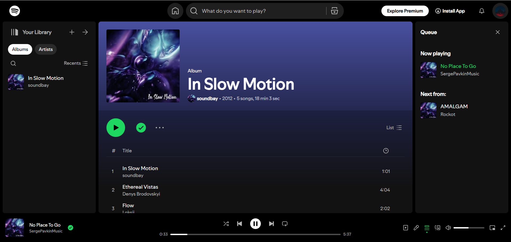

  # Spotify-Fullstack

   

  A fullstack Spotify clone

  <a href='https://spotify-clone-ls8p.onrender.com' target='_blank'>Live Demo</a></a>*&#8224;

* Deployed using <a href='https://render.com/'>Render</a> free version, needs about 50s at first load

&#8224; Content from <a href='https://pixabay.com/music/'>Pixabay royalty free music</a>

## Screenshots
Home page
</img>
Album page
</img>

## Roadmap
### Music app
Functionality
- [x] Play album
- [x] Manage play status
- [x] Infinite scrolling on home page
- [ ] Sync queue
- [ ] Manage library & queue
- [ ] Playlist
- [ ] Artist

UI
- [x] Fine tuned layout
- [x] Sticky header in home page
- [x] Responsive seekbar and volume bar
- [ ] Sticky header in album page
- [ ] Hover effect on buttons
- [x] Right click menu

### Admin panel
Functionality
- [x] Add/delete album & song
- [x] Read song metadata automatically
- [x] Calculate average color album artwork automatically
- [ ] Bulk upload
- [ ] Update album & song
- [ ] Manage user