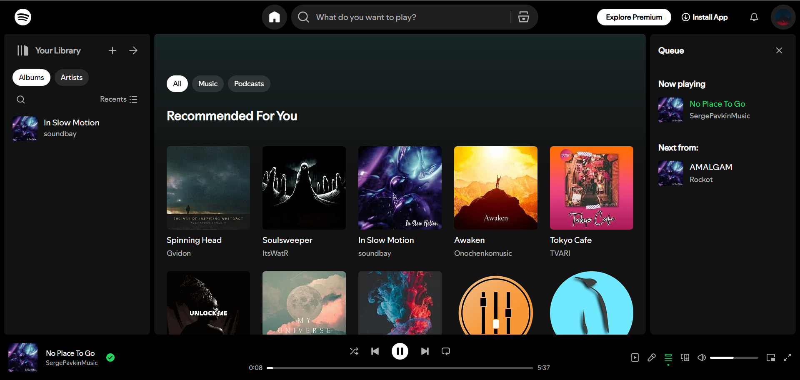

  # Spotify-Fullstack

   

  全栈仿Spotify音乐流媒体平台

  <a href='https://spotify-clone-ls8p.onrender.com' target='_blank'>查看Demo</a>*&#8224;
  

* 使用<a href='https://render.com/'>Render</a>免费版部署，初次加载需要约50s

&#8224; 内容来自<a href='https://pixabay.com/music/'>Pixabay免版税音乐</a>

## 截图
主页
</img>
专辑页
</img>

## 开发路线
### 音乐流媒体软件
功能
- [x] 播放专辑
- [x] 控制播放状态
- [ ] 主页懒加载
- [ ] 自动同步播放队列
- [ ] 管理音乐库和播放队列
- [ ] 播放列表
- [ ] 艺术家

界面
- [x] 精美的布局
- [x] 主页的粘性header
- [x] 可交互的进度条和音量条
- [ ] 专辑页的粘性header
- [ ] 按钮鼠标悬浮效果
- [ ] 右键菜单

### 后台管理系统
- [x] 添加/删除专辑和歌曲
- [x] 自动提取歌曲元数据
- [x] 自动计算专辑封面平均颜色
- [ ] 批量上传
- [ ] 修改专辑和歌曲
- [ ] 管理用户信息